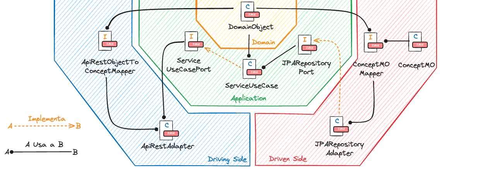
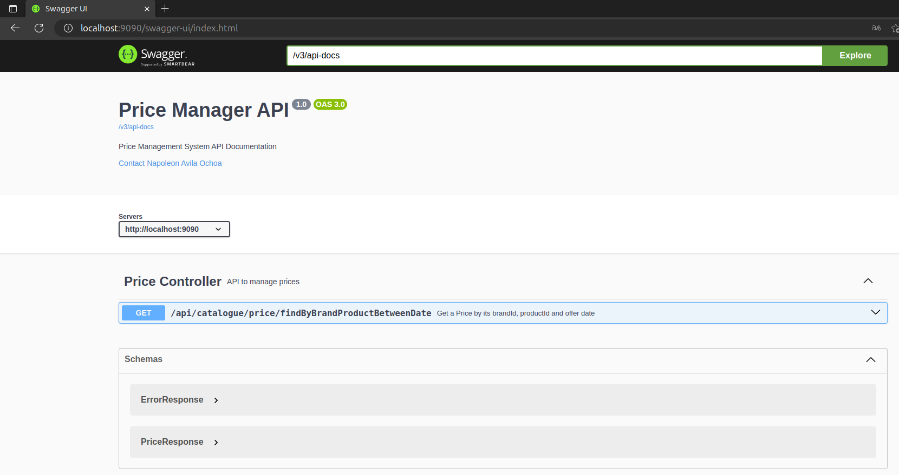
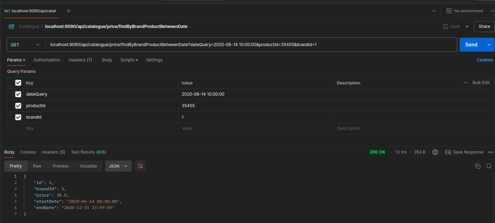
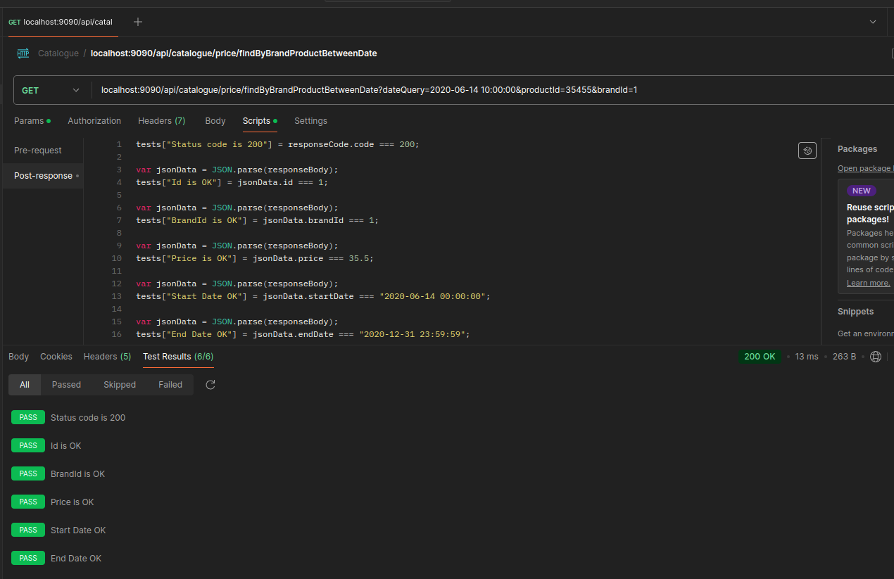

# Price List MS Spring Boot

Development of a microservice implementing clean code and hexagonal architecture using the Spring Boot framework.

This application uses an H2 database, which is an in-memory database.

### Architecture Description

A hexagonal architecture (Driven-Driving) is proposed, highlighting two types of elements within it: Ports and Adapters.

The architecture suggests that the domain should be the core of the layers and not coupled to anything external. Instead of depending on concrete implementations, it couples to contracts (interfaces or ports) through the dependency inversion principle.

The main concepts are:

* **Port:** Definition of a public interface.
* **Adapter:** Specialization of a port for a specific context.

This structure, where the domain is the core of all layers (or regions) and not coupled to anything external, aligns well with Domain Driven Design (DDD).


The implementation in Spring Boot is detailed below:

* **Application (application module):** This module defines the driving and driven ports, and develops the business logic. The UseCase is an implementation of the driving port and uses driven ports when necessary, as shown in the center of the diagram. Additionally, the domain classes are defined within this module.


* **Driving Side (driving modules):** These modules use the driving ports, as seen in the blue part of the diagram, allowing external components (Kafka consumer, REST API) to interact with the domain.


* **Driven Side (driven modules):** These modules implement the driven ports, as seen in the red part of the diagram, allowing the domain to interact with external components (database, buckets, Kafka production, REST client).

Additionally, there is a (Boot) module that defines the assembly of the different modules of the application into a .jar package. This module contains the class that runs the microservice and groups the functional modules (REST API and repository, etc.).



### Compilation and Startup
To compile and have all resources ready, run the following command:

```bash
mvn clean install
```

To start the application, run the following command:

```bash
java -jar boot/target/price-manager-web-back-boot-1.0.0.jar
```

### Application Swagger

Access the Swagger interface at the following link:

* http://localhost:9090/swagger-ui/index.html



### Testing

We recommend using Postman by importing the collection from this link: 

* [Catalogue.postman_collection_V2.json](https://github.com/NAO0325/price-manager-web-back/blob/main/boot/src/main/resources/Catalogue.postman_collection_V2.json)

### Example <font color="green">GET</font> Request

* http://localhost:9090/api/catalogue/price/findByBrandProductBetweenDate?dateQuery=2020-06-14T10:00:00&productId=35455&brandId=1




